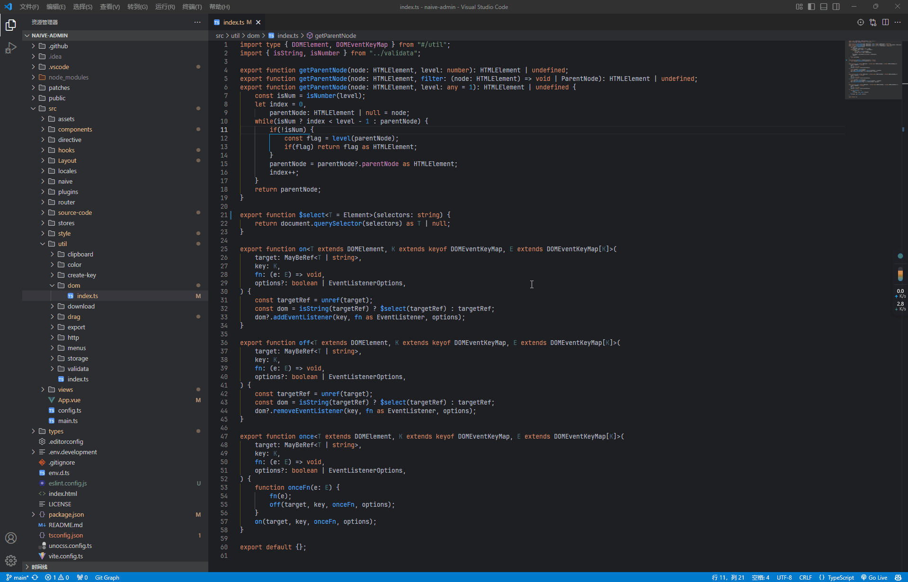

# File Location

Add a location button like jetbrains IDEs to locate the current file, this plugin does not fold folders

像jetbrains IDE一样, 增加定位到当前文件的按钮, 并且不折叠打开的目录

fork from [vscode-location](https://github.com/yx1126/vscode-location)

### Example:

